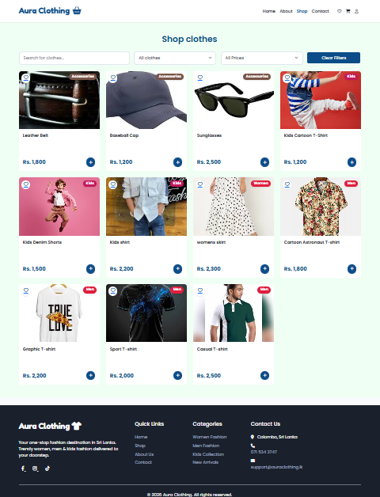
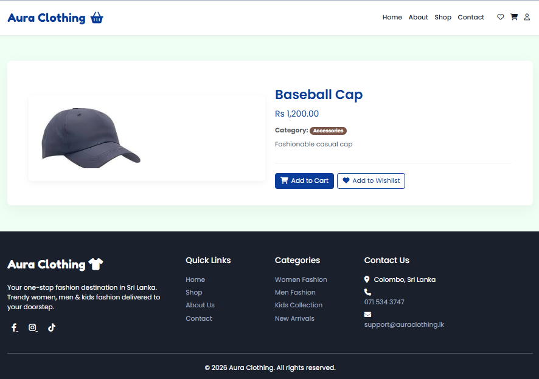
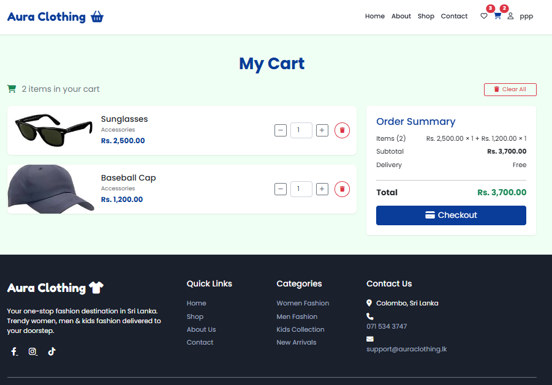
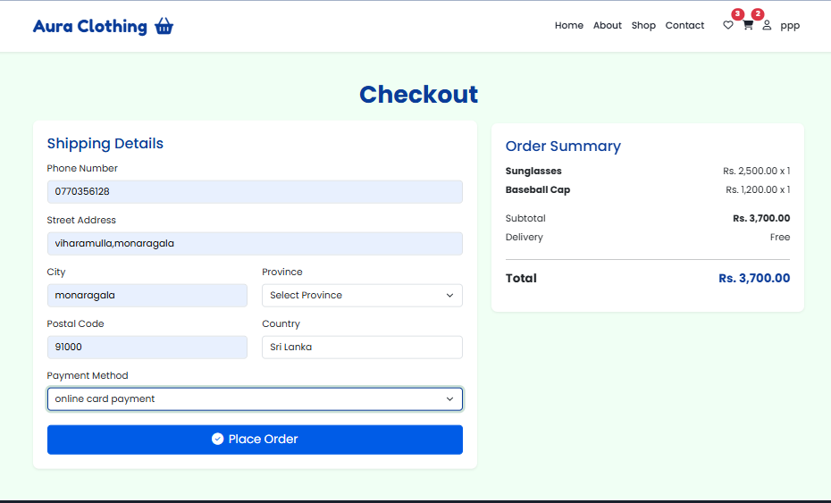
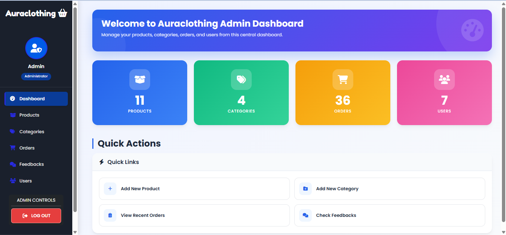

# 🛍️ Aura Clothing E-Commerce Website
<p align="center">


</p>

A modern and responsive e-commerce web application developed for online clothing shopping. Customers can browse products, add items to their cart or wishlist, place orders securely, and manage their accounts. The system also includes an admin dashboard for managing products, categories, users, and orders.

---

## 📌 Project Overview

Aura Clothing is a full-stack web application built using PHP and MySQL. It provides a user-friendly shopping experience while allowing administrators to efficiently manage the online store.

---

## 📊 GitHub Statistics


<p align="center">


</p>


## 🛠️ Tech Stack

<p align="center">


</p>


## ✨ Features

### 👤 User Features
- User Registration & Login
- Browse Products
- Search & Filter Products
- Product Categories
- Shopping Cart
- Wishlist
- Secure Checkout
- Order History
- User Profile Management

### 🔧 Admin Features
- Admin Login
- Dashboard
- Manage Products
- Manage Categories
- Manage Users
- Manage Orders
- Inventory Management

---

## 🛠️ Technologies Used

### Frontend
## 🛠️ Built With


### Backend


### Database


### Development Tools
- XAMPP
- phpMyAdmin
- Git
- GitHub
- Visual Studio Code

---

# 📷 Screenshots

## Home Page


---

## Shop Page



---

## Product Details



---

## Shopping Cart



---

## Checkout



---

## Admin Dashboard



---

# 🎥 Demo Video

▶️ Watch the demo here:


https://github.com/user-attachments/assets/64e8d866-dda6-4680-bcc4-0bfee8036074

---


---

# 📂 Project Structure

```
Aura-Clothing/
│
├── admin/
├── assets/
├── config/
├── database/
├── includes/
├── uploads/
├── screenshots/
│   ├── home.png
│   ├── shop.png
│   ├── product.png
│   ├── cart.png
│   ├── checkout.png
│   └── dashboard.png
│
├── index.php
├── shop.php
├── cart.php
├── checkout.php
├── wishlist.php
├── login.php
├── register.php
└── README.md
```

---

# ⚙️ Installation

### 1. Clone the Repository

```bash
git clone https://github.com/pamudimaleesha/aura-clothing.git
```

### 2. Move the Project

Copy the project folder into your XAMPP `htdocs` directory.

Example:

```
C:\xampp\htdocs\Aura-Clothing
```

### 3. Create the Database

Create a database named:

```
aura_clothing
```

Import the SQL file into phpMyAdmin.

### 4. Configure Database

Update:

```
config/db.php
```


### 5. Start XAMPP

Start:

- Apache
- MySQL

### 6. Open the Project

```
http://localhost/Aura-Clothing/
```

---

# 📋 Future Improvements

- Online Payment Gateway
- Email Notifications
- Product Reviews
- Discount Coupons
- Sales Reports
- Responsive Admin Dashboard
- Dark Mode

---

# 👩‍💻 Developer

**Pamudi Maleesha**

HNDIT Undergraduate

GitHub:
https://github.com/pamudimaleesha

LinkedIn:
https://linkedin.com/in/pamudirohitha

---

# 📄 License

This project was developed for educational purposes.

---

⭐ If you like this project, don't forget to give it a Star!
